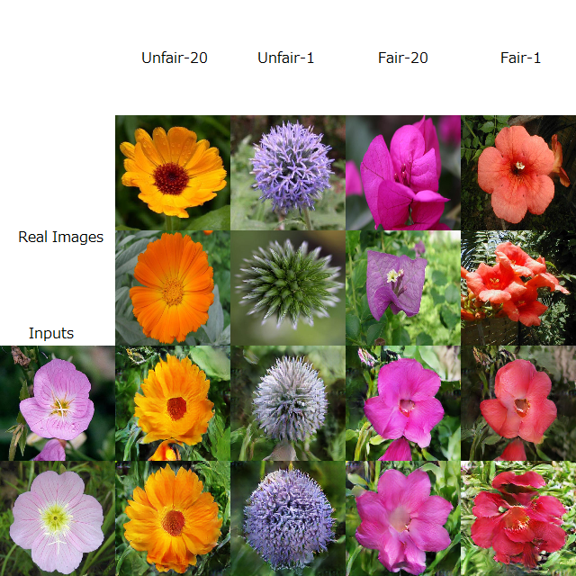

# FUNIT-TF
A implementation of FUNIT using TensorFlow.

This is under experiment now.

I referred to the implementation of [taki0112's FUNIT](https://github.com/taki0112/FUNIT-Tensorflow). see also it.

## Offical Page, Paper and code

[Few-Shot Unsupervised Image-to-Image Translation(Page)](https://nvlabs.github.io/FUNIT/)

[Few-Shot Unsupervised Image-to-Image Translation(Paper)](https://arxiv.org/abs/1905.01723)

[FUNIT(code)](https://github.com/NVlabs/FUNIT)

## Usage
1. Put the folder containing the wav files for training in named datasets.

  And Put the folder containing a K or more image files for validation in datasets_val.
 
  like this

```
...
│
datasets
|   │
|   ├── class_1
|   │     ├── class1_1.jpg
|   │     ├── class1_2.png
|   │     ├── ...
|   │     └── class1_i.png
|   ├── class_2
|   │     ├── class2_1.png
|   │     ├── class2_2.jpg
|   │     ├── ...
|   │     └── class2_j.png 
|   ...
|   └── class_N
|         ├── classN_1.jpg
|         ├── classN_2.jpg
|         ├── ...
|         └── classN_k.png    
datasets_val
|   │
|   ├── class_N+1
|   │     ├── classN+1_1.jpg
|   │     ├── classN+1_2.png
|   │     ├── ...
|   │     └── classN+2_l.png
|   ├── class_N+2
|   │     ├── classN+2_1.jpg
|   │     ├── classN+2_2.jpg
|   │     ├── ...
|   │     └── classN+2_n.jpg 
|   ...
|   └── class_M
|         ├── classM_1.png
|         ├── classM_2.jpg
|         ├── ...
|         └── classM_m.jpg 
...
├── btgen.py     
├── eval.py
...
```

2. Train FUNIT.

```
python train.py
```

5. After training, inference can be performed.

   content folder and style folder must be designated.
  


```
python eval.py --content_dir class_1 --class_dir class_N+5 --K 5 --img_size 128
```

## Result examples
I show training result of [Flowers dataset](https://www.robots.ox.ac.uk/~vgg/data/flowers/).

The two lines above are style images.

The left two are content images.

The bottom right eight are the output images.


